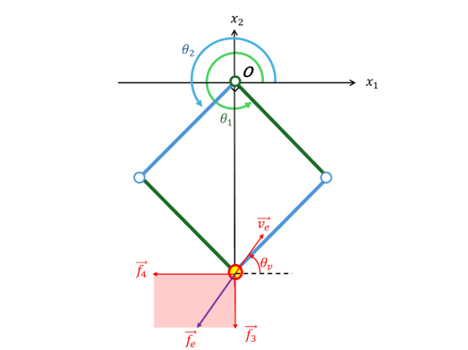

# parallel-link-static-analysis

大学の卒業研究で作成した、平行リンク型力覚提示装置の
運動学・静力学解析および可視化プログラムです。

ブレーキ式・クラッチ式の2種類の力覚提示装置について、
リンク角度や外力方向などから手先に発生する抵抗力を計算し、
Pythonで力ベクトルと力覚提示可能範囲を可視化しました。

This repository contains a Python program developed for my undergraduate research.
It analyzes the kinematics and statics of parallel-link haptic devices and
visualizes endpoint forces and feasible force-feedback regions.

## 動作概要
使用ライブラリ


### 逆運動学ファイル
マウスカーソルの座標に応じてロボットアーム先端の座標が変更され、計算結果が表示されます。
手元のPCからpythonファイルを実行すれば動作します。

### 順運動学ファイル
実行時にθ1,θ2の指定が必要です。
コマンドプロンプトにθを入力後、ロボットアーム先端を動かす方向を指定する角度 θv を指定します。
電圧の値についても聞かれますが、これは実験室装置由来の定数です。この値が大きければ大きいほど大きな力が発生します。



いずれの角度も図の角度を基準としています。

## 解析概要

### 1. 平行リンク機構の運動学

リンク長を L、リンク角度を θ₁, θ₂ とすると、
手先位置 xₑ は次のように表されます。

xₑ₁ = L cos θ₁ + L cos θ₂
xₑ₂ = L sin θ₁ + L sin θ₂

これを微分し、ヤコビ行列 J(θ) を用いて

ẋₑ = J(θ)θ̇

として手先速度とリンク角速度の関係を求めます。

### 2. 静力学解析

仮想仕事の原理から、リンクに作用するトルク τ と
手先抵抗力 fₑ の関係を

τ = Jᵀ(θ)fₑ

として導出し、

fₑ = J⁻ᵀ(θ)τ

から手先に発生する抵抗力を計算します。

計算式例

```math
\begin{bmatrix}
f_{e1} \\
f_{e2}
\end{bmatrix}
=
\frac{1}{-L\sin(\theta_1-\theta_2)}
\begin{bmatrix}
\cos\theta_2 & -\cos\theta_1 \\
\sin\theta_2 & -\sin\theta_1
\end{bmatrix}
\begin{bmatrix}
\tau_1 \\
\tau_2
\end{bmatrix}
```

### 3. ブレーキ式・クラッチ式の比較

MR流体ブレーキを利用する方式とMRクラッチを利用する方式について、
それぞれトルクと手先抵抗力の関係をモデル化しました。

外力方向とリンク姿勢からトルクの方向を判定し、
各方式で提示可能な力の範囲を計算します。

### 4. Pythonによる可視化

導出した式をPythonで実装し、

- リンク姿勢
- 外力方向
- 各アクチュエータによる力ベクトル
- 合力
- 力覚提示可能範囲

を可視化しました。

## Keywords

Python / Kinematics / Statics / Jacobian Matrix /
Haptic Device / Numerical Analysis / Visualization
